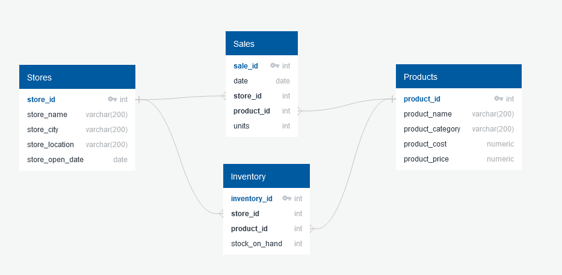
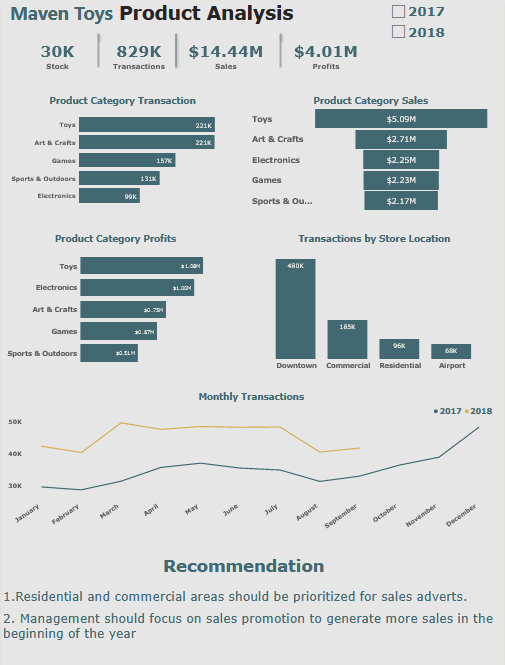

## Maven Toys Data Analytics using dbt 

<br />

## This data analysis project gives details on the Sales & Inventory data for a fictitious chain of toy stores in Mexico called Maven Toys.

## Using dbt, data was transformed and cleaned in order to make it usable for analysis. 

<br />

<h1 align="center"> 
  
</h1>
<br>

<h1 align="center"> 
  
</h1>

<br>

## Dashboard created using Power BI:

<h1 align="center"> 
  
</h1>

<br>

# Prerequisite
## [Power BI]()

## [PostgreSQL]()


<br>

## Steps to run the project
<br />

## Create a directory from the command line
```commandline
  mkdir [name-of-directory]
  cd [name-of-directory]
```

## Create virtual environment
```commandline
  python3 -m venv venv
```
## Activate virtual environment

### Windows
```commandline
  source venv/Scripts/activate
```

### Linux
```commandline
  source venv/bin/activate
```
<br>

## Install dbt postgres 
```python
  pip install dbt-postgres
```
## Clone Repository
```commandline
  git clone https://github.com/AviatorIfeanyi/maven_toys_dbt_postgres.git
  
  cd maven_toys_dbt_postgres

```

## Set database requirements using credentials in profiles.example.yml

<br>

## Run project
```commandline
  dbt run
```

## Run dbt documentation
```python
 dbt docs generate

 dbt docs serve
```

## DBT Concepts used

### - sources
### - models
### - tests
### - docs
### - materialization
### - profiles
### - assets